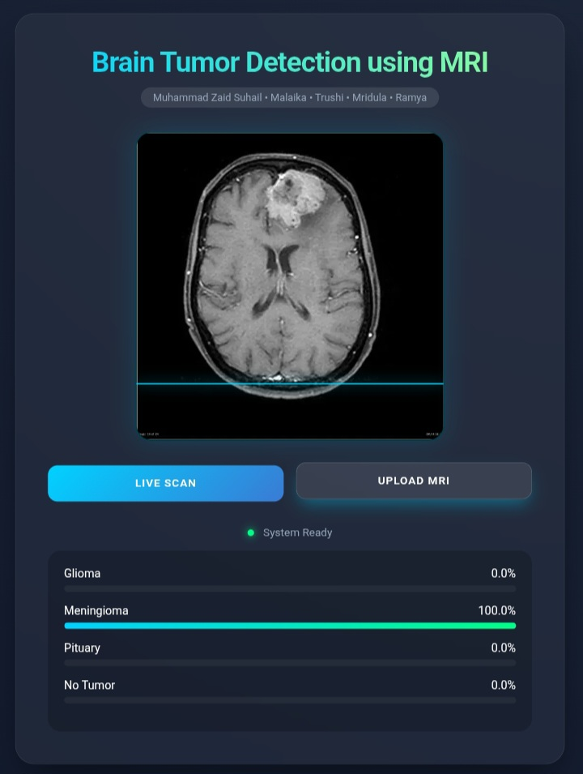

# 🧠 NeuroScan AI: Brain Tumor Classification
**A Modern, Real-Time Web Solution for MRI Analysis**

---

## 🚀 Overview
NeuroScan AI is a **proof-of-concept** medical diagnostic tool that utilizes Deep Learning to classify brain MRI scans into four distinct categories. Designed with a focus on clinical accessibility, the project features a "Glassmorphism" UI and browser-based inference.

### 🎯 Core Capabilities:
* **Glioma Detection:** Identification of high-grade malignancies.
* **Meningioma & Pituitary Analysis:** Structural tumor differentiation.
* **Healthy Baseline:** Near-perfect recall for healthy brain tissue.
* **Dual Input Mode:** Live Webcam scanning + Image File upload.

---

## 💻 Tech Stack
* **AI Engine:** TensorFlow.js / Teachable Machine
* **Frontend:** HTML5, CSS3 (Glassmorphism), JavaScript (ES6)
* **Deployment:** GitHub Pages (SSL Encrypted)

---

## 🖼️ Interface Preview
| Desktop Viewfinder | Real-Time Classification |
| :---: | :---: |
|  |  |

> *Note: Replace the images above by uploading 'interface_screenshot.jpg' to this repository.*

---

## 👥 The Team
Developed as a collaborative AI Health Initiative by:
* **Muhammad Zaid Suhail**
* **Malaika**
* **Trushi Patel**
* **Mridula Afroz Prionty**
* **Ramya**

---

## 🛡️ Ethics & Privacy
1. **Local Processing:** MRI scans are processed entirely in the browser. No medical data is uploaded to any server.
2. **Clinical Aid:** This tool is intended to assist healthcare professionals, not replace clinical diagnosis.